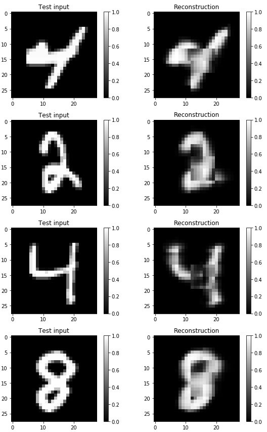
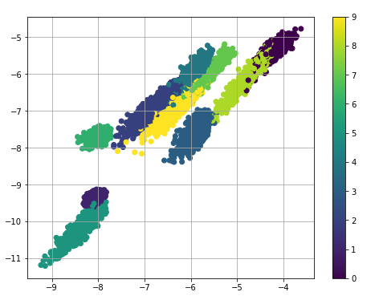

# Conditional Variational Autoencoder
[](https://www.tensorflow.org/)
[](https://www.tensorflow.org/)

Implement variants of Variational Autoencoder by tensorflow.
Experiment for MNIST dataset.


## Conditional VAE
I have built two type of CVAE:
1. 3CNN (`./model/cvae_cnn3.py`)
    - encoder: CNN x 3 + FC x 1
    - decoder: deCNN x 3 + FC x 1 
2. 2CNN (`./model/cvae_cnn2.py`)
    - encoder: CNN x 2 + FC x 1
    - decoder: deCNN x 2 + FC x 1
 
2CNN model use CNN with fixed stride (2 x 2) and kernel size (4 x 4).
The problem of this model is that, the size of learnable variables of FC (fully connected) layer is much larger 
than that of CNN layer.
More precisely, if the latent dimension is 20, the learnable variables becomes
**20 x 512 = 10240** for FC and **4 x 16 x 32 = 2048** for the biggest CNN.
It might be difficult to learn such a huge FC layer that it could be trapped local minima or cause overfitting.

In other hand, 3CNN model have relatively small learnable variables for FC, which has **20 x 64 = 1280** and the last CNN has **9 x 32 x 64 = 18432**.

Here is the reconstruction result of 3CNN model.
<p align="center">
  
  <br><i>reconstruction 3CNN model</i>
</p>

By setting latent dimension for two, you can visualize the latent space.
<p align="center">
  
  <br><i>2d latent space</i>
</p>

Here is the reconstruction result of 2CNN model. 
<p align="center">
  
  <br><i>reconstruction 2CNN model</i>
</p>

It seems that the training is somewhat failed, and 3CNN is much easy to train than 2CNN.  
You can test by simply run
```
python train_cvae_cnn3.py
```
to start train model for MNIST and
the visualization is summarized at `visualization_cvae.ipynb`.
For theoretic analysis for CVAE, see [Semi-supervised Learning with Deep Generative Models](http://papers.nips.cc/paper/5352-semi-supervised-learning-with-deep-generative-models).

## VAE
To run VAE (Variational Auto-Encoder) for MNIST,

```
python train_vae.py
```

Once the model is trained, you can see the reconstruction result. 
<p align="center">
  
  <br><i>reconstruction</i>
</p>

By setting latent dimension for two, you can visualize the latent space.
<p align="center">
  
  <br><i>2d latent space</i>
</p>

The visualization is summarized at `visualization_vae.ipynb`.
More detail, see [Auto-Encoding Variational Bayes](https://arxiv.org/abs/1312.6114).

## CNN
To find the best stride and depth of layer, I have implemented deep CNN model for classification.
The network consists of four CNN layer, and each layer includes max pooling and dropout.  
To run the test for mnist,

```
python train_cnn.py
```
Then, the model and logs are saved at `./log/cnn`.

For mnist classification, this model achieves over 98 % validation accuracy.

<p align="center">
  
  <br><i>learning log</i>
</p>


### Reference
- [1] Kingma, Diederik P., and Max Welling. "Auto-encoding variational bayes." arXiv preprint arXiv:1312.6114 (2013).
- [2] Kingma, Diederik P., et al. "Semi-supervised learning with deep generative models." Advances in Neural Information Processing Systems. 2014.