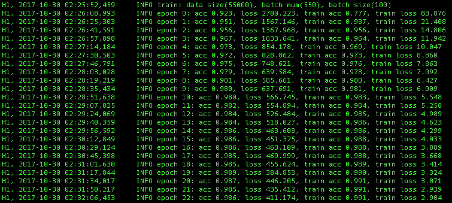

# Variational Autoencoder
[](https://www.tensorflow.org/)

Implement variants of Variational Autoencoder by tensorflow.
Experiment for MNIST dataset.

### Models
- Conditional VAE
    - deep CNN version
        - encoder: CNN x 3 + FC x 1
        - decoder: dCNN x 3 + FC x 1 
    - shallow CNN version
        - encoder: CNN x 2 + FC x 1
        - decoder: dCNN x 2 + FC x 1 
- Vanilla VAE
- CNN (5 CNN, dropout, max pooling)

## VAE
To run VAE (Variational Auto-Encoder) for MNIST,

```
python train_vae.py
```

Once the model is trained, you can see the reconstruction result. 
<p align="center">
  
  <br><i>reconstruction</i>
</p>

By setting latent dimension for two, you can visualize the latent space.
<p align="center">
  
  <br><i>latent space image</i>
</p>

The visualization is summarized at `visualization_vae.ipynb`
More detail, see [Auto-Encoding Variational Bayes](https://arxiv.org/abs/1312.6114).

## CNN
To find the best stride and depth of layer, I have implemented deep CNN model for classification.
The network consists of four CNN layer, and each layer includes max pooling and dropout.  
To run the test for mnist,

```
python train_cnn.py
```
Then, the model and logs are saved at `./log/cnn`.

For mnist classification, this model achieves over 98 % validation accuracy.

<p align="center">
  
  <br><i>learning log</i>
</p>
