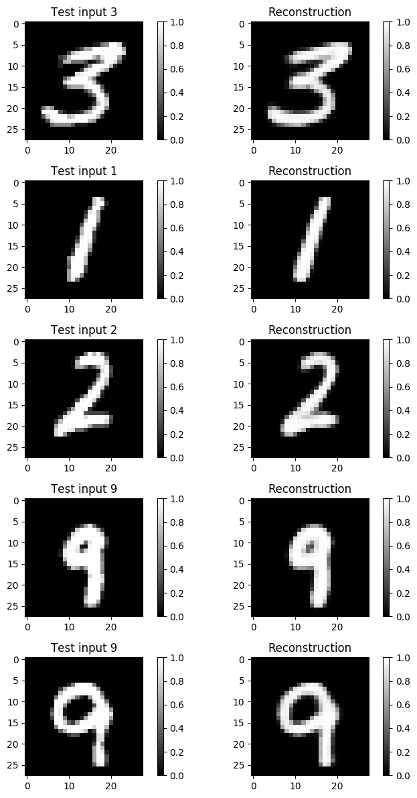

# Conditional Variational Autoencoder
[](https://www.tensorflow.org/)

Implement 
[CVAE (Conditional Variational Autoencoder)](http://papers.nips.cc/paper/5352-semi-supervised-learning-with-deep-generative-models)
and 
[VAE (Variational Autoencoder)](https://arxiv.org/abs/1312.6114)
by tensorflow. Experiment for [MNIST dataset](http://yann.lecun.com/exdb/mnist/).


## Model
This repository includes following three type of CVAE:
1. [3 CNN](model/cvae_cnn3.py): encoder (CNN x 3 + FC x 1) and decoder (CNN x 3 + FC x 1) 
2. [2 CNN](model/cvae_cnn2.py):  encoder (CNN x 2 + FC x 1) and decoder (CNN x 2 + FC x 1)
3. [3 FC](model/cvae_fc3.py):   encoder (FC x 3) and decoder (FC x 3)

At first, I have implemented 2 CNN model uses CNN with fixed stride (2 x 2) and kernel size (4 x 4).
However, there are problems with this model that, the size of trainable variables of FC (fully connected) layer is much larger 
than that of CNN layer.
More precisely, if the latent dimension is 20, the trainable variables becomes
**20 x 512 = 10240** for FC and **4 x 16 x 32 = 2048** for the biggest CNN.
It might be difficult to learn such a huge ./FC layer and the effect of CNN layer would be vanished.
In other hand, 3CNN model has relatively small trainable variables of FC, which has **100** and
CNN has **6336** for the first layer and **8192** for the second and third layer.

FC2 was implemented aiming to see how better the CNN 3 model is than FC based CVAE.
But it seems that FC2 model behaves very well as generative model (I mention more in later section).
 

## How to use
Clone the repository 

```
git clone https://github.com/asahi417/ConditionalVariationalAutoEncoder.git cvae
cd cvae                                                       
```

To train 3 CNN model for MNIST,
```
python train.py cvae_cnn3 -n 2 -c 1 -l 0.001 -e 400 -l 0.001
```

then, plotting some graphs by 

```
python plot.py cvae_cnn3 -n 2
```

The trained model is saved at `./log` and figures are at `./figure`.

## Result of Each Model for Mnist
Let's see some results for Mnist data. 

### Reconstruction
Here is the reconstruction result of 3CNN model.
<p align="center">
  
  <br><i>reconstruction (3CNN)</i>
</p>

<p align="center">
  
  <br><i>reconstruction (3FC)</i>
</p>

<p align="center">
  
  <br><i>reconstruction (VAE)</i>
</p>


### Generate by Random Variable

<p align="center">
  
  <br><i>2d latent space</i>
</p>


Here is the reconstruction result of 2CNN model. 
<p align="center">
  
  <br><i>reconstruction 2CNN model</i>
</p>

### 2-D Latent Space

## Appendix
To find the best stride and depth of layer, simple deep CNN model for classification has been implemented.
This consists of four CNN layer, and each layer includes max pooling and dropout.  
For mnist classification, this model achieves over 98 % validation accuracy.

<p align="center">
  
  <br><i>learning log</i>
</p>


### Reference
- [1] Kingma, Diederik P., and Max Welling. "Auto-encoding variational bayes." arXiv preprint arXiv:1312.6114 (2013).
- [2] Kingma, Diederik P., et al. "Semi-supervised learning with deep generative models." Advances in Neural Information Processing Systems. 2014.